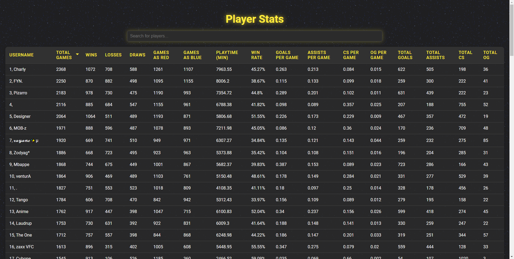
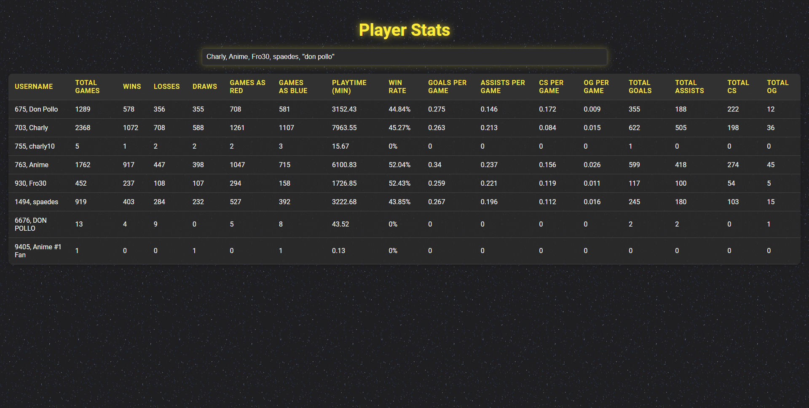

# lirs-analyzer
player statistics table for haxball lirs

`note: this data has been manually fetched and currently isn't automatically updated`
## Features

### Table
  - 16 measured statistics for each player
    - headers can be clicked to sort by ascending/descending
    - sort will retain current search
    - only players who played +100 games have averages such as winrate or goals per game
  - loads first 100 players, dynamically extends table as you scroll down
  - statistics taken straight from lirs discord
  - fast and responsive

### Search Bar
  - find a specific player's stats
  - search and compare multiple players at once
    - add a comma between each username
  - find players with a similar username
  - strict search feature to decrease clutter in table
    - add quotes around the username
    - the search is case-insensitive

`discord: i_9029`
